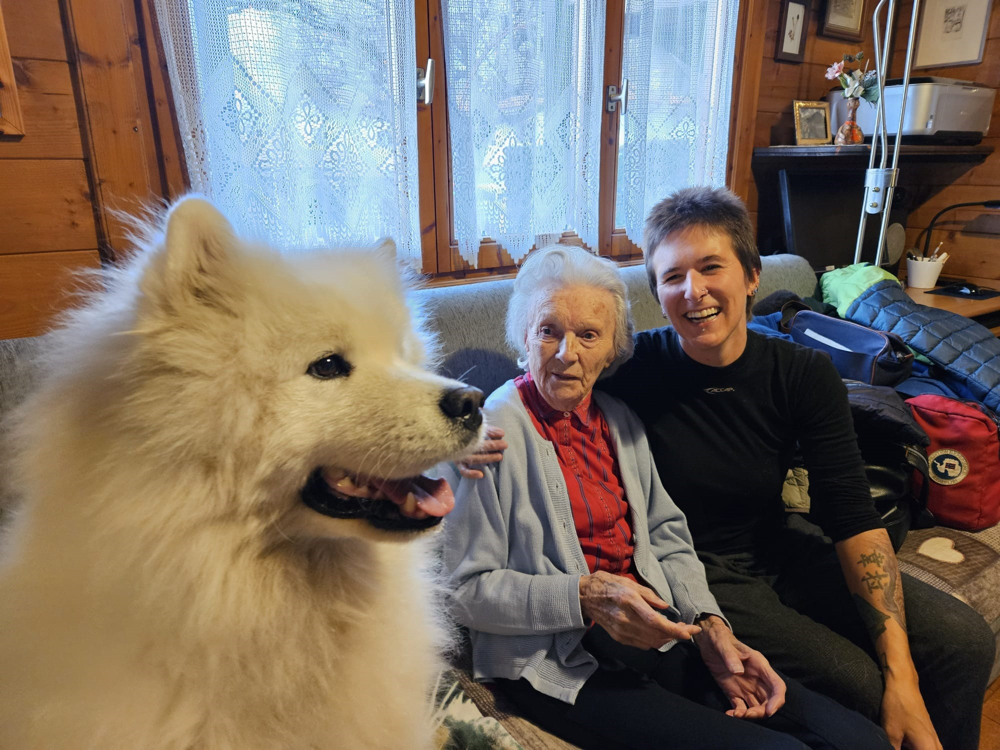

# Anny Randy

welcome to my website!  

## my basics :)

  

    
    
- researcher

  

  

    
    
- surfer

  

   

    
    
- singer

  

  

    
    
- 80s

  

  

    
    
- hiking

  

   

    
    
- loving

  

## it might seem that I'm like this at times...

## but I am actually protecting this :)

  

